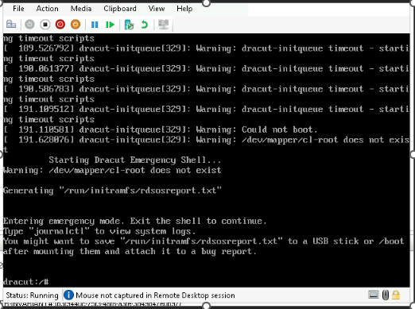
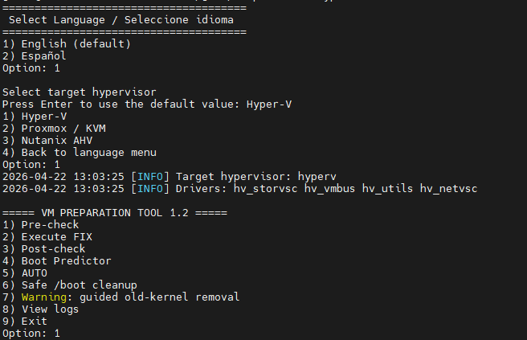
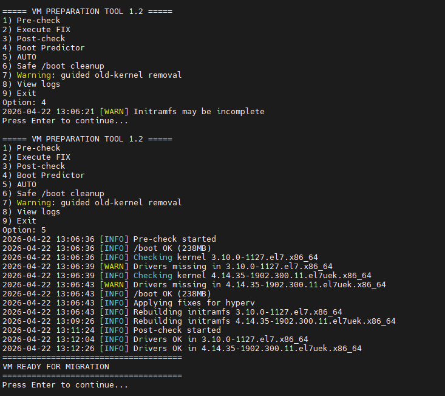
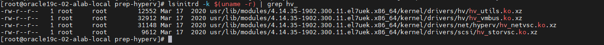

# 🚀 Linux VM Migration Prep Tool (Multi-Hypervisor)


---

## 🎬 Demo


---

## 📸 Screenshots

### Error when migrating without preparation


### Menu


### Execution


### Result


---

## 🧠 Overview

This tool prepares Linux virtual machines for **cross-hypervisor migration**, ensuring the system boots successfully after being moved from VMware to:

- Microsoft Hyper-V  
- Proxmox (KVM)  
- Nutanix AHV  

It performs:

- system validation  
- driver injection into `initramfs`  
- boot simulation  
- safe remediation  

👉 Result: **predictable and low-risk migrations**

---

## 🎯 What Problem Does It Solve?

When migrating between hypervisors, the virtual hardware changes:

| VMware | Target |
|--------|--------|
| vmxnet3 | hv_netvsc / virtio_net |
| pvscsi | hv_storvsc / virtio_scsi |

If required drivers are NOT present in `initramfs`:

- ❌ VM fails to boot  
- ❌ Root disk not detected  
- ❌ System drops into dracut emergency shell  

---

## 🧩 initramfs (Why it matters)

The **initramfs** is a temporary filesystem loaded at boot.

### It is responsible for:

- Loading storage and network drivers  
- Detecting disks and LVM  
- Mounting the root filesystem  

👉 If it lacks correct drivers → system will NOT boot

---

## ⚙️ dracut (How it works here)

**dracut** builds the initramfs dynamically.

### Problem:
It builds based on CURRENT environment (VMware)

### Solution (this tool):

- Forces target drivers
- Rebuilds initramfs safely
- Applies rollback if needed

👉 Makes boot process **predictable and migration-aware**

---

## ⚙️ Key Features

- ✅ Pre-check validation (non-intrusive)
- 🔧 Automated fix (driver injection + rebuild)
- 🔁 Rollback protection
- 🧪 Boot predictor
- 🌐 Multi-hypervisor support
- 🌍 Multi-language (EN / ES)
- 🧹 Safe `/boot` cleanup
- ⚠️ Guided kernel removal (safe mode)
- 📜 Centralized logging

---

## 🧠 Smart Driver Isolation (v1.2)

The tool **only injects required drivers per target hypervisor**:

### Hyper-V
- hv_storvsc
- hv_vmbus
- hv_utils
- hv_netvsc

### KVM / AHV
- virtio_blk
- virtio_pci
- virtio_net
- virtio_scsi

### Additionally:

- ❌ Unused drivers are explicitly omitted
- ❌ Prevents mixed driver environments
- ✔ Cleaner and safer initramfs

---

## 🖥️ Supported OS

- Oracle Linux  
- RHEL  
- CentOS  
- Rocky Linux  
- AlmaLinux  

---

## 👤 Who Should Use This?

- Linux Administrators  
- Virtualization Engineers  
- Cloud / Infra Engineers  
- Migration / DR teams  

---

## ⚠️ Requirements

- Root access  
- `/boot` with **≥ 200MB free**  
- dracut installed  
- RHEL-based OS  

---

## 🚀 Execution

### Fix Windows format issues

```bash
sed -i 's/\r$//' prep-tool.sh

Grant permissions
chmod +x prep-tool.sh
Run
sudo ./prep-tool.sh
🌍 Language Selection

At startup:

1) English (default)
2) Español
🧭 Recommended Workflow
1) Safe /boot cleanup (if needed)
2) Pre-check
3) AUTO
🔄 Script Modes
Mode	Description
Pre-check	Validate system
FIX	Apply changes
Post-check	Validate result
Boot Predictor	Simulate boot
AUTO	Full workflow
Safe /boot cleanup	Free space safely
Kernel warning	Suggest removal
📂 Logs
/var/log/prep-hyperv/latest.log
🧹 Safe /boot Handling (v1.2)

The tool safely handles /boot:

Removes orphan initramfs
Removes rescue files
Keeps latest kernels
If space is low:

The tool will show:

Required: 200MB
Available: X MB
⚠️ Guided Kernel Removal

New safe mode:

Does NOT remove anything automatically
Suggests removable kernel
Provides exact command

Example:

yum remove kernel-<version>
🧪 Pre-Migration Steps (CRITICAL)
sync
shutdown -h now
Why sync?
Flush filesystem buffers
Prevent corruption
Ensure consistency
🖥️ Hypervisor Configuration
Setting	Value
Disk	VHDX
Controller	SCSI
Type	Dynamic
Firmware	Same as source
🔍 Firmware Detection
[ -d /sys/firmware/efi ] && echo UEFI || echo BIOS
Result	Use
BIOS	Gen1
UEFI	Gen2

⚠️ Do NOT change firmware

🧪 Post-Migration Validation
Hyper-V:
lsmod | grep hv_
KVM/AHV:
lsmod | grep virtio
⚠️ Common Errors
❌ bad interpreter
sed -i 's/\r$//' prep-tool.sh
❌ dracut shell
Missing drivers
Re-run tool
❌ Low /boot space
Use cleanup
Use kernel warning
🔐 Safety Design
✔ Non-destructive
✔ No automatic kernel removal
✔ Rollback included
✔ Controlled execution
🎯 Expected Result
VM READY FOR MIGRATION
⚠️ Important Considerations
Always test first
Do NOT mix hypervisor drivers
Keep fallback kernel
Keep firmware consistent
📜 License

MIT

🤔 Why this tool?

Cross-hypervisor migrations fail due to missing drivers.

👉 This tool makes migrations:

predictable
repeatable
safe
🤝 Contributing

Pull requests are welcome.

⚠️ Disclaimer

This tool modifies initramfs and boot configuration.

Use responsibly and test before production.

